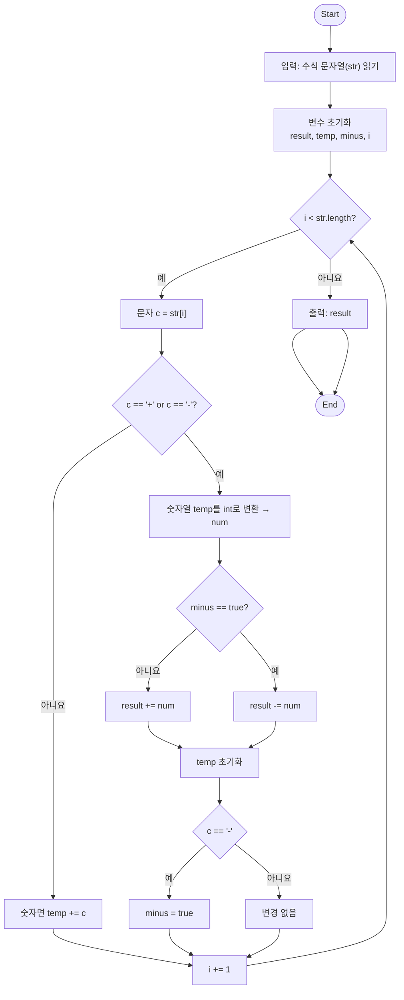

# [Silver II] 잃어버린 괄호 - 1541 

[문제 링크](https://www.acmicpc.net/problem/1541) 

### 성능 요약

메모리: 2024 KB, 시간: 0 ms

### 분류

수학, 그리디 알고리즘, 문자열, 파싱

### 제출 일자

2025년 5월 15일 12:07:03

### 문제 설명

세준이는 양수와 +, -, 그리고 괄호를 가지고 식을 만들었다. 그리고 나서 세준이는 괄호를 모두 지웠다.

그리고 나서 세준이는 괄호를 적절히 쳐서 이 식의 값을 최소로 만들려고 한다.

괄호를 적절히 쳐서 이 식의 값을 최소로 만드는 프로그램을 작성하시오.

### 입력 

 
첫째 줄에 식이 주어진다. 식은 ‘0’~‘9’, ‘+’, 그리고 ‘-’만으로 이루어져 있고, 가장 처음과 마지막 문자는 숫자이다. 그리고 연속해서 두 개 이상의 연산자가 나타나지 않고, 5자리보다 많이 연속되는 숫자는 없다. 수는 0으로 시작할 수 있다. 입력으로 주어지는 식의 길이는 50보다 작거나 같다.

### 출력 

 
첫째 줄에 정답을 출력한다.

